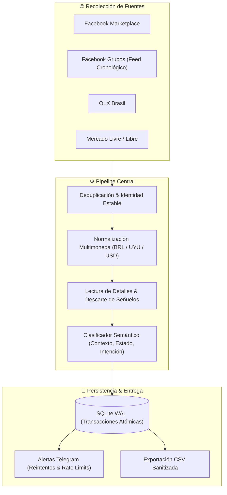

<div align="center">

# 🏍️ Motoradar

**Radar inteligente y monitor transfronterizo de motos de oportunidad ($\le$ R$ 1.000)**  
*Detección continua en tiempo real, clasificación semántica contextual y alertas automáticas.*

[](https://github.com/vibecoding-rm/motoradar/actions/workflows/tests.yml)
[](https://www.python.org/downloads/)
[-brightgreen.svg)](#-verificación-y-qa)
[](LICENSE)
[](#)

</div>

---

## 🎯 Objetivo y Filosofía de Producto

Motoradar es una herramienta especializada diseñada para operar en la frontera **Jaguarão (Brasil) ↔ Río Branco (Uruguay)** y áreas de influencia. Su misión es detectar **motos completas para reparar, armar o revender** con un precio de compra tope de **R$ 1.000** (o su equivalente en pesos uruguayos $U / dólares US$).

### Reglas Clave de Dominio
* **Motos enteras sin exclusión artificial**: Acepta motos en marcha, averiadas, proyectos y unidades para donantes (*doadoras*).
* **Papeles y margen NO filtran**: Una moto sin documentos o con margen incierto no se descarta; la oportunidad se alerta para evaluación humana.
* **Precios dudosos / señuelos**: Precios simbólicos (*"R$ 0"*, *"R$ 1.234"*, anticipos o cuotas) se aíslan y marcan como **PRECIO POR CONFIRMAR** antes de entrar al pipeline presupuestario.
* **Tolerancia a fallos honesta**: Distinción estricta entre *"cero publicaciones encontradas"* y *"DOM no reconocido / sesión caída"*. Si una fuente está ciega, el sistema lo informa y emite alertas de salud.

---

## 🏗️ Arquitectura del Pipeline

El sistema implementa un ciclo de vida desacoplado y transaccional:



---

## 🚀 Inicio Rápido

### Requisitos
* **Python 3.12+**
* Entorno probado en Windows (PowerShell) y Linux.

### 1. Instalación y Entorno Virtual
```powershell
# Clonar el repositorio
git clone https://github.com/vibecoding-rm/motoradar.git
cd motoradar

# Crear entorno virtual e instalar dependencias
python -m venv .venv
.\.venv\Scripts\Activate.ps1    # En Linux: source .venv/bin/activate
pip install -r requirements.txt
```

### 2. Inicialización
```powershell
# Crear archivo de configuración config.yaml desde la plantilla
python -m motoradar init

# Diagnóstico de arranque y salud del entorno
python -m motoradar doctor
```

### 3. Configuración (`config.yaml`)
Edita `config.yaml` para establecer tus parámetros:
* **`budget`**: Presupuesto máximo (ej. `1000` BRL).
* **`filters.cities`**: Ciudades monitoreadas (`"Jaguarao"`, `"Rio Branco"`).
* **`telegram`**: `chat_id` y `token` (el token puede definirse como variable de entorno `TELEGRAM_BOT_TOKEN`).

---

## 🖥️ Comandos del CLI

Motoradar cuenta con una interfaz de comandos completa y orientada a la observabilidad:

| Comando | Descripción |
|---|---|
| `python -m motoradar doctor` | Diagnóstico integral: fuentes activas, estado de Telegram, entregas pendientes y última corrida. |
| `python -m motoradar status` | Comprueba si la sesión de Facebook en el navegador headless sigue autenticada y viva. |
| `python -m motoradar login` | Abre un navegador para autenticar sesión en Facebook y guardar el perfil local. |
| `python -m motoradar collect` | Recolección rápida sin modificar la base de datos ni enviar alertas (`--format json/csv/console`). |
| `python -m motoradar run` | Una pasada completa de recolección, enriquecimiento, persistencia y despacho de alertas. |
| `python -m motoradar run --dry-run` | Corrida de prueba completa sin escribir en disco ni enviar mensajes externos. |
| `python -m motoradar watch` | Vigilancia continua en bucle con cadencia configurable (`--interval 15`) y guardas anti-bloqueo. |
| `python -m motoradar retry` | Despacho forzado de alertas que fallaron temporalmente por red o límites de Telegram. |
| `python -m motoradar deals` | Vista analítica de consola con tasaciones de mercado y oportunidades agrupadas. |
| `python -m motoradar explain` | Explicación detallada de cada aviso visto y la causa exacta por la que pasó o se descartó. |

---

## 🛡️ Resiliencia y Garantías Operativas

* **SQLite en modo WAL + Locks Exclusivos**: Previene colisiones entre ejecuciones concurrentes y asegura recuperación limpia tras cortes abruptos de energía.
* **Reintentos Individuales con Backoff HTTP 429**: Telegram procesa cada destinatario por separado. Si Telegram devuelve rate-limit o un usuario bloquea el bot, el sistema aísla el incidente sin frenar al resto del equipo.
* **Detección de DOM Roto vs. Cartel Vacío**: Si los selectores de una fuente dejan de materializar datos debido a cambios en la plataforma, el sistema emite una alerta de salud inmediata en lugar de fingir una pasada normal vacía.
* **Sanitización de Datos de Vendedores**: Prevención activa de inyección de fórmulas CSV (`=`, `+`, `-`, `@`) y ofuscación de números telefónicos y datos sensibles.

---

## 🧪 Verificación y QA

La suite de pruebas automatizadas es **100% hermética, offline y reproducible**, sin llamadas a APIs externas ni aperturas accidentales de navegadores:

```powershell
# Ejecución de todos los tests unitarios, robustez y suites E2E (339 tests)
python -m unittest discover -s tests -v

# Validación de sintaxis y compilación limpia
python -m compileall -q motoradar tests
```

---

## 📂 Estructura del Proyecto

```text
motoradar/
├── motoradar/             # Núcleo del sistema
│   ├── appraise.py        # Tasación y modelos de referencia
│   ├── cli.py             # Interfaz de comandos (CLI)
│   ├── config.py          # Carga y validación estricta de configuración
│   ├── enrich.py          # Enriquecimiento con vista de detalle
│   ├── filters.py         # Filtros léxicos y delimitación geográfica
│   ├── models.py          # Dataclasses de dominio (Listing, Appraisal)
│   ├── money.py           # Conversor multimoneda con caché FX
│   ├── notify.py          # Envíos seguros a Telegram y exportador CSV
│   ├── pipeline.py        # Orquestador central de recolección y descarte
│   ├── store.py           # Capa de persistencia SQLite transaccional
│   └── sources/           # Adaptadores modulares
│       ├── base.py        # Interfaz abstracta BaseSource
│       ├── facebook.py    # Playwright headless para Marketplace y Grupos
│       ├── mercadolivre.py# Adaptador de Mercado Libre / Livre
│       └── olx.py         # Adaptador OLX Brasil
├── tests/                 # Suite de tests (339 tests)
├── docs/                  # Documentación profunda de arquitectura y decisiones
└── config.example.yaml    # Configuración base documentada
```

---

## 🔒 Privacidad y Seguridad

* **Sin almacenamiento de credenciales en el repositorio**: Tokens, chat IDs, perfiles de sesión y bases de datos reales están estrictamente ignorados por Git.
* **Sanitización de Informes**: Todas las auditorías públicas en `docs/auditorias/` son completamente anónimas y carecen de datos de vendedores, tokens o identificadores privados.

---

## 📄 Licencia

Este proyecto está licenciado bajo la [Licencia MIT](LICENSE) - consulta el archivo [LICENSE](LICENSE) para más detalles.
