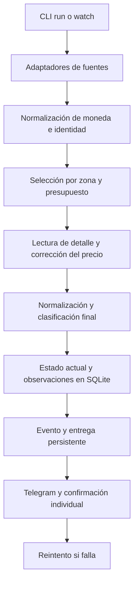

# Arquitectura y contratos actuales

## Forma de despliegue

Monolito modular en Python con CLI, SQLite local y adaptadores de proveedores.
Un proceso es propietario de cada corrida normal y de su base mediante locking.py.
El perfil de Facebook es persistente y externo al repositorio.

Las observaciones recogidas que se descartan también se guardan en corridas
normales. No se almacena todo el mercado: solo lo devuelto por las búsquedas.

## Responsabilidades

| Módulo | Responsabilidad |
|---|---|
| cli.py | Comandos, orquestación, diagnóstico y vigilancia |
| sources/ | Búsqueda por proveedor; errores y cobertura parcial |
| models.py | Listing, identidad, texto e importes |
| money.py | Tasas, caché y conversión |
| filters.py | Zona y preferencias de texto |
| enrich.py | Descripciones y corrección de precios inciertos |
| pipeline.py | Selección compartida y estado de alerta |
| appraise.py | Tipo de artículo, intención, condición y señales informativas |
| market.py | Referencias y margen opcional para deals |
| store.py | Estado, observaciones, corridas y bandeja de entregas |
| notify.py | Consola, CSV, envío Telegram y reintentos |
| locking.py | Exclusión de procesos sobre una base |

## Datos persistidos

- `listings`: estado actual por uid, first_seen y last_seen; metadata en raw.
- `observations`: snapshots de cambios observados, con fecha UTC.
- `deliveries`: destinatario, snapshot, motivo, intentos, retry_at y sent_at.
- `runs`: inicio, final, estado de fuentes y cantidades seleccionadas.

El esquema usa user_version=1 y migración aditiva del esquema inicial. Los importes
siguen siendo float/REAL; la transición a unidades menores/Decimal es pendiente.
La moneda queda en raw porque la tabla histórica no tiene columna currency.
No hay retención automática de observaciones o corridas.

## Invariantes

1. Identidad por fuente/id; similitud de título/precio no fusiona anuncios.
2. Cambio de moneda/precio exige normalización antes de presupuesto o margen.
3. Papeles, margen y disponibilidad de referencias no determinan elegibilidad.
4. Estado `unconfirmed` no se presenta como precio elegible confirmado.
5. Actualización del anuncio y creación de entrega son atómicas.
6. Solo una respuesta Telegram HTTP satisfactoria con JSON ok=true confirma entrega.
7. Fallo de envío no elimina el pendiente. retry_after aplaza al destinatario.
8. Página de duplicados no demuestra fin de paginación.

## Límites conocidos

- El lock de base no impide dos bases distintas usando el mismo perfil Facebook.
- Detalles pueden fallar o quedar incompletos y no hay caché con TTL.
- Una desaparición no demuestra venta; un pendiente puede referir un anuncio ya retirado.
- No hay confirmación de precio mediante contacto con el vendedor.
- Un timeout tras aceptación Telegram puede causar duplicado al reintentar.
- Grupos usan región aproximada, no geolocalización verificada.
- OAuth de Mercado Livre, variantes de modelos y múltiples importes necesitan revisión.
- La cadencia de watch es duración de búsqueda más pausa configurada.

Cambios de arquitectura y criterios de salida: [ROADMAP.md](ROADMAP.md).
