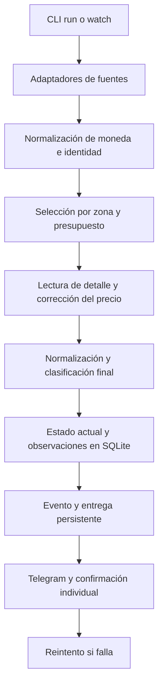

# Arquitectura y contratos actuales

## Forma de despliegue

Monolito modular en Python con CLI, SQLite local y adaptadores de proveedores.
Un proceso es propietario de cada corrida normal y de su base mediante locking.py.
El perfil de Facebook es persistente y externo al repositorio.

Las observaciones recogidas que se descartan también se guardan en corridas
normales. No se almacena todo el mercado: solo lo devuelto por las búsquedas.

## Responsabilidades

| Módulo | Responsabilidad |
|---|---|
| cli.py | Comandos, orquestación, diagnóstico y vigilancia |
| sources/ | Búsqueda por proveedor; errores y cobertura parcial |
| models.py | Listing, identidad, texto e importes |
| money.py | Tasas, caché y conversión |
| filters.py | Zona y preferencias de texto |
| enrich.py | Descripciones y corrección de precios inciertos |
| pipeline.py | Selección compartida y estado de alerta |
| appraise.py | Tipo de artículo, intención, condición y señales informativas |
| market.py | Referencias y margen opcional para deals |
| store.py | Estado, observaciones, corridas y bandeja de entregas |
| notify.py | Consola, CSV, envío Telegram y reintentos |
| locking.py | Exclusión de procesos sobre una base |

## Datos persistidos

- `listings`: estado actual por uid, first_seen y last_seen; metadata en raw.
- `observations`: snapshots de cambios observados, con fecha UTC.
- `deliveries`: destinatario, snapshot, motivo, intentos, retry_at, sent_at y
  `state`. Un fallo permanente (bot bloqueado, chat inexistente, token
  inválido) marca `dead` en vez de reintentarse cada hora para siempre.
- `destination_state`: pausa persistente por destinatario para respetar HTTP 429.
- `runs`: inicio, final, estado de fuentes y cantidades seleccionadas.
- `health_notices`: último aviso de salud por motivo y fuente, con cooldown,
  para no repetir el mismo problema en cada pasada.

El esquema usa user_version=4. `deliveries.state` (`pending`/`dead`) se añadió
con una migración por versión: `SCHEMA` solo crea tablas que falten, así que
una columna nueva necesita su paso explícito, y `PRAGMA user_version` se
escribe recién cuando la migración termina. Los importes
siguen siendo float/REAL; la transición a unidades menores/Decimal es pendiente.
La moneda queda en raw porque la tabla histórica no tiene columna currency.
No hay retención automática de observaciones o corridas.

## Invariantes

1. Identidad por fuente/id; similitud de título/precio no fusiona anuncios.
2. Cambio de moneda/precio exige normalización antes de presupuesto o margen.
3. Papeles, margen y disponibilidad de referencias no determinan elegibilidad.
4. Estado `unconfirmed` no se presenta como precio elegible confirmado.
5. Actualización del anuncio y creación de entrega son atómicas.
   `Store.upsert_many` decide el evento sobre la observación anterior una sola
   vez y crea/actualiza las entregas de todos los destinatarios en esa transacción.
6. Solo una respuesta Telegram HTTP satisfactoria con JSON ok=true confirma entrega.
7. Fallo de envío no elimina el pendiente. retry_after aplaza al destinatario.
8. Página de duplicados no demuestra fin de paginación.
9. Una fuente distingue `ok`, `partial` y `error`; resultados parciales no se
   confunden con una búsqueda vacía.
10. Cero resultados exige evidencia de página vacía. Un feed presente pero con
    cero hijos **también** es ceguera: exigir solo el contenedor dejaba pasar un
    grupo que no materializó ni un post. Sin tarjetas, sin posts y sin cartel de
    vacío, la fuente se declara ciega (`dom_failures`) y la corrida informa
    `error`, nunca `ok` con cero observaciones.
10b. La salud se mide por **superficie**, no por fuente: `observed_by_origin`
    lleva `facebook/marketplace` y un `facebook/grupo-<id>` por grupo, y las
    superficies declaradas que observan cero aparecen con cero. Medir solo la
    fuente permitía que 150 avisos de Marketplace tapasen ocho grupos ciegos.
11. Una sesión caída es `SessionExpired`, distinta de un fallo de búsqueda: el
    vigilante pausa esa fuente y avisa en vez de reintentar contra el checkpoint.
12. Toda alerta lleva enlace accionable. Sin permalink se reconstruye desde el id
    del post y, en último caso, se enlaza el grupo declarando `url_confidence`.
13. La falta de ubicación se declara (`region_unknown`), no se sustituye por las
    ciudades buscadas: un dato ausente no puede hacerse pasar por coincidencia.
14. Cada destinatario tiene su propia entrega, intentos y pausa por 429. Un
    fallo hacia uno no cancela ni retrasa la alerta hacia otro, y el anuncio se
    persiste una sola vez aunque se avise a varios. El evento (alta, bajada de
    precio, paso a elegible) se decide **una vez por anuncio** contra la
    observación anterior, antes de escribir: calcularlo por destinatario hacía
    que el segundo de la lista comparase el aviso contra sí mismo y no recibiera
    nunca una bajada de precio.
15. El texto escrito por terceros se redacta al entrar (`scrub_personal`:
    teléfonos, e-mails y enlaces) y el histórico tiene plazo de borrado
    (`monitoring.retention_days`). El feed de grupos captura publicaciones de
    vecinos que no venden nada y antes quedaban enteras en la base y en el CSV.
16. Un aviso de salud marca su cooldown recién cuando alguien lo recibió: si el
    envío falla, se reintenta en la pasada siguiente. Marcarlo antes hacía que
    un corte de red de segundos comprara seis horas de silencio sobre un radar
    ciego, que es el peor escenario del producto.
17. Un secreto no vive en el árbol del proyecto: el token se lee del entorno o
    de `~/.motoradar/telegram_token`, y escrito en `config.yaml` se rechaza al
    arrancar. Una búsqueda de texto sobre el proyecto lo expone sin abrir el
    archivo.

## Límites conocidos

- El lock de base no impide dos bases distintas usando el mismo perfil Facebook.
- Detalles pueden fallar o quedar incompletos y no hay caché con TTL.
  `detail_status` distingue lectura, descripción no reconocida, fallo y omisión
  por límite; los encabezados de vehículo/descripción se prueban con texto simulado,
  no constituyen validación del DOM actual de Facebook.
- Una desaparición no demuestra venta; un pendiente puede referir un anuncio ya retirado.
- No hay confirmación de precio mediante contacto con el vendedor.
- Un timeout tras aceptación Telegram puede causar duplicado al reintentar.
- Grupos usan región aproximada, no geolocalización verificada; un grupo sin
  `group_cities` queda marcado como zona sin verificar y el filtro de ciudad no
  se aplica a sus avisos.
- El feed cronológico da frescura y recall, pero sigue acotado por `group_items`
  y `group_budget_s`: es una muestra reciente, no el grupo completo.
- La detección de DOM roto depende de que Facebook siga mostrando un cartel de
  vacío; un rediseño que elimine también ese cartel volvería a confundir cero
  resultados con fuente ciega, y por eso existen los avisos por silencio sostenido.
- El contrato entre una fuente y `collect` es por convención, no por tipo:
  `collect` lee `failed_pages`, `dom_failures`, `errors` y `expected_origins` con
  `getattr` y valores por defecto. Una fuente que no los declare informa salud
  optimista en silencio; hoy solo Facebook los declara completos. Formalizarlo en
  una clase base está en el ROADMAP.
- `scrub_personal` cubre teléfonos, e-mails y enlaces. No cubre nombres ni
  direcciones escritas en prosa: el plazo de borrado es lo que acota ese residuo.
- `posted_at` sigue vacío para los posts de grupo, así que la frescura que aporta
  el feed cronológico no es medible todavía.
- OAuth de Mercado Livre, variantes de modelos y múltiples importes necesitan revisión.
- La cadencia de watch es duración de búsqueda más pausa configurada.

Cambios de arquitectura y criterios de salida: [ROADMAP.md](ROADMAP.md).
